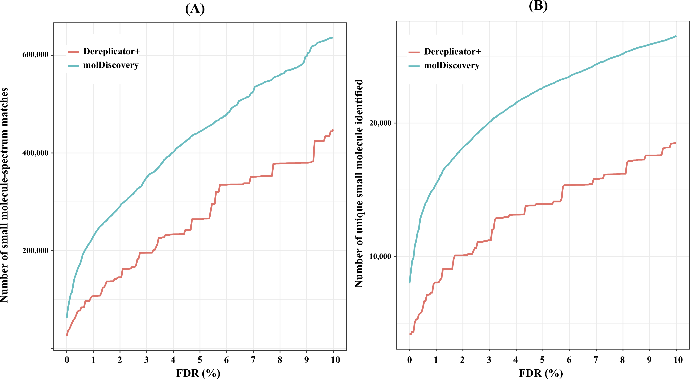

<font size=30>__molDiscovery: Learning Mass Spectrometry Fragmentation of Small Molecules__</font>

## About MolDiscovery

MolDiscovery is a mass spectral database search method that improves both efficiency and accuracy of 
small molecule identification by (i) utilizing an efficient algorithm to generate mass spectrometry fragmentations, 
and (ii) learning a probabilistic model to match small molecules with their mass spectra.
A search of over six million spectra from global natural product social molecular networking infrastructure 
shows that our probabilistic model can correctly identify nearly twice more small molecules than previous method.

MolDiscovery is developed in collaboration of [Carnegie Mellon University](http://mohimanilab.cbd.cmu.edu) (PA, USA) and
[Saint Petersburg State University](http://cab.spbu.ru) (Russia). 
The current version (alpha) can be downloaded from <https://github.com/mohimanilab/molDiscovery/releases>.
The stable release and all further versions will be available in the **N**atural **P**roduct **D**iscovery **tool**kit (**NPDtools**) at <https://github.com/ablab/npdtools>.

## Installation & Running instructions
Please refer to the [NPDtools manual](docs/NPDtools-2.6.0-alpha-manual.md) for all details. 
Specific details regarding molDiscovery are in [this section](docs/NPDtools-2.6.0-alpha-manual.md#sec_run_db_moldiscovery).

Basic example (this is for Linux, please substitute `Linux` to `Darwin` for replicating on macOS):
``` bash
    wget https://github.com/mohimanilab/molDiscovery/releases/download/npdtools-2.6.0-alpha/NPDtools-2.6.0-alpha-Linux.tar.gz
    tar -xzf NPDtools-2.6.0-alpha-Linux.tar.gz
    cd NPDtools-2.6.0-alpha-Linux
    python2.7 bin/moldiscovery.py share/npdtools/test_data/moldiscovery/ --db-path share/npdtools/test_data/sample_database/ -o moldiscovery_outdir
``` 
If the run is finished correctly, you will see identifications of a nonribosomal peptide (Surugamide) and a polyketide (Chalcomycin) 
listed in `moldiscovery_outdir/significant_matches.tsv`. The column names are self-explanatory in principle but you can always 
find more details in the [corresponding section](docs/NPDtools-2.6.0-alpha-manual.md#sec_run_output) of the manual.

## Results

### Massive GNPS analysis
We analyzed more than six six million spectra from global natural product social molecular networking infrastructure 
(GNPS, <https://gnps.ucsd.edu/>) using molDiscovery and regular Dereplicator+. 
The figure below demonstrates performance of the both tools at different false discovery rate (FDR) levels.  
The curves show the number of (A) small molecule-spectrum matches and (B) unique compounds identified by 
Dereplicator+ and molDiscovery in the search of 50 GNPS spectral datasets against AntiMarin.



### Pseudomonas dataset manual curation
We benchmarked molDiscovery against Dereplicator+ on top 100 identifications from extensively studied GNPS dataset 
[MSV000079450](https://gnps.ucsd.edu/ProteoSAFe/result.jsp?task=5728ca4b0dfd4c058e0ef6151a31f9c4&view=advanced_view) 
(400,000 spectra from Pseudomonas isolates). For each identified compound we checked its origin using a literature search. 
Out of the [top 100 small molecule-spectra matches](data/Pseud.molDisc.top100.annotated.tsv) reported by molDiscovery, 
78 correspond to compounds having Pseudomonas origin based on taxonomies reported for molecules in AntiMarin database. 
The second largest genus among the identifications (20 out of 100) is Bacillus. 
However, these molecule-spectra matches are still likely to be true positives since the dataset is known to be contaminated 
with Bacillus species (see [Gurevich et al, 2018](https://www.nature.com/articles/s41564-017-0094-2)). 
While the [top 100 identifications from Dereplicator+](data/Pseud.Dereplicator+.top100.annotated.tsv) 
also contains 20 Bacillus matches, the number of hits related to Pseudomonas species is just 62, 
that is 25% lower than molDiscovery. 
18 identifications of Dereplicator+ are annotated as having fungi origin which makes them likely false positives.
A subset of the AntiMarin database used in this search and containing all compounds from both top-100 lists can be downloaded 
[here](data/Pseud.top100.sample_db.tar.gz).


## Feedback and Bug reports  
Your comments, bug reports, and suggestions are very welcomed. 
They will help us to further improve NPDtools in general and molDiscovery in particular.
You can leave them at [our GitHub repository tracker](https://github.com/ablab/npdtools/issues) 
or sent them via support e-mail: <npdtools.support@cab.spbu.ru>. 
